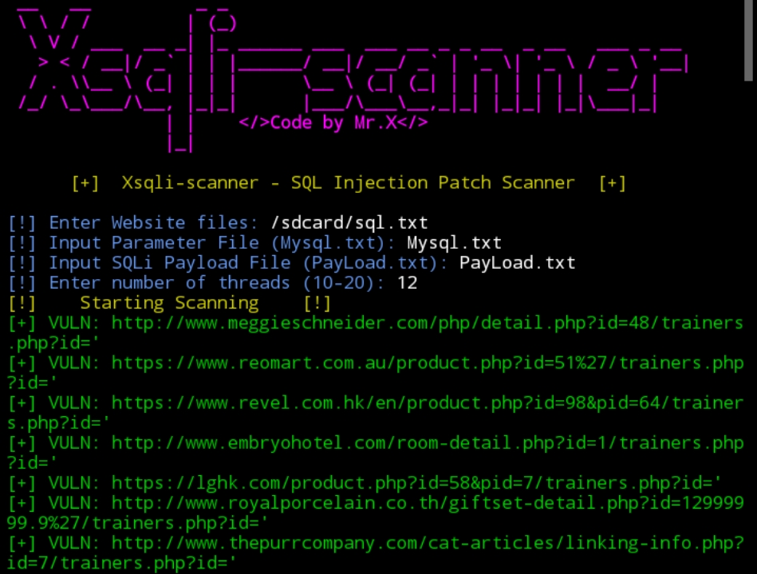

# Xsqli-scanner


## introduction
Introducing Xsqli-scanner - SQL Injection 💉 Patch Scanner.Greetings, security professionals and enthusiasts! I’m excited to present Xsqli-scanner, a powerful and efficient tool designed to identify SQL Injection vulnerabilities in websites. Built with a multi-threading architecture, Xsqli-scanner offers fast and reliable scanning across multiple sites and parameters simultaneously.

## Instalations
```
$ pkg update -y && pkg upgrade -y
$ apt update -y && apt upgrade -y
$ pkg install git
$ pkg install python -y
$ git clone https://github.com/Whomrx666/Xsqli-scanner.git
$ cd Xsqli-scanner 
$ python Xsqli-scanner.py
```

## Instructions
- **first**: Install tools according to the instructions above
- **second**: Create a txt folder containing websites that have SQL injection vulnerabilities 
- **third**: After that, enter the txt folder that you have created and Also enter the file parameters and file payload and threads too
- **last**: The tool will start to describe all sql vulnerabilities in any section and will save it in the Vuln.txt folder when it is finished

# All Features
| Key Features | ✔️ |
|--------|--------|
| **Multi-threaded Scanning for faster performance** |✔️ |
| **Custom Payload Support: You can provide your own SQLi payloads for thorough testing** |✔️ |
| **Error Detection: Identifies potential SQL Injection points based on error messages** |✔️ |
| **Duplicate Prevention: The scanner ensures no duplicate URLs are reported** |✔️ |
| **Detailed Logging: Automatically saves all vulnerable URLs to Vuln.txt for further analysis** |✔️ |
| **User-Friendly Interface with clear CLI and color-coded output for easy tracking** |✔️ |
---------

## Observation
This is a tool for education only, I am not responsible for any misuse
### Original Author
<a href="https://github.com/Whomrx666"></a>

### <<< If you copy , Then Give me The Credits >>>

## CONNECT WITH ME :

[](https://whomrxhackers.blogspot.com/)
[](https://twitter.com/whomrx666)
[](https://youtube.com/@whomrx666)
[](https://facebook.com/https://www.facebook.com/whomrx.666)
[](https://t.me/@Whomr_X)
[](mailto:whomrx666@gmail.com)
[](https://www.tiktok.com/@whomr.x)

**If you want to donate, click on the button**
<a href="https://saweria.co/whomrx"></a>

### Visitors :
